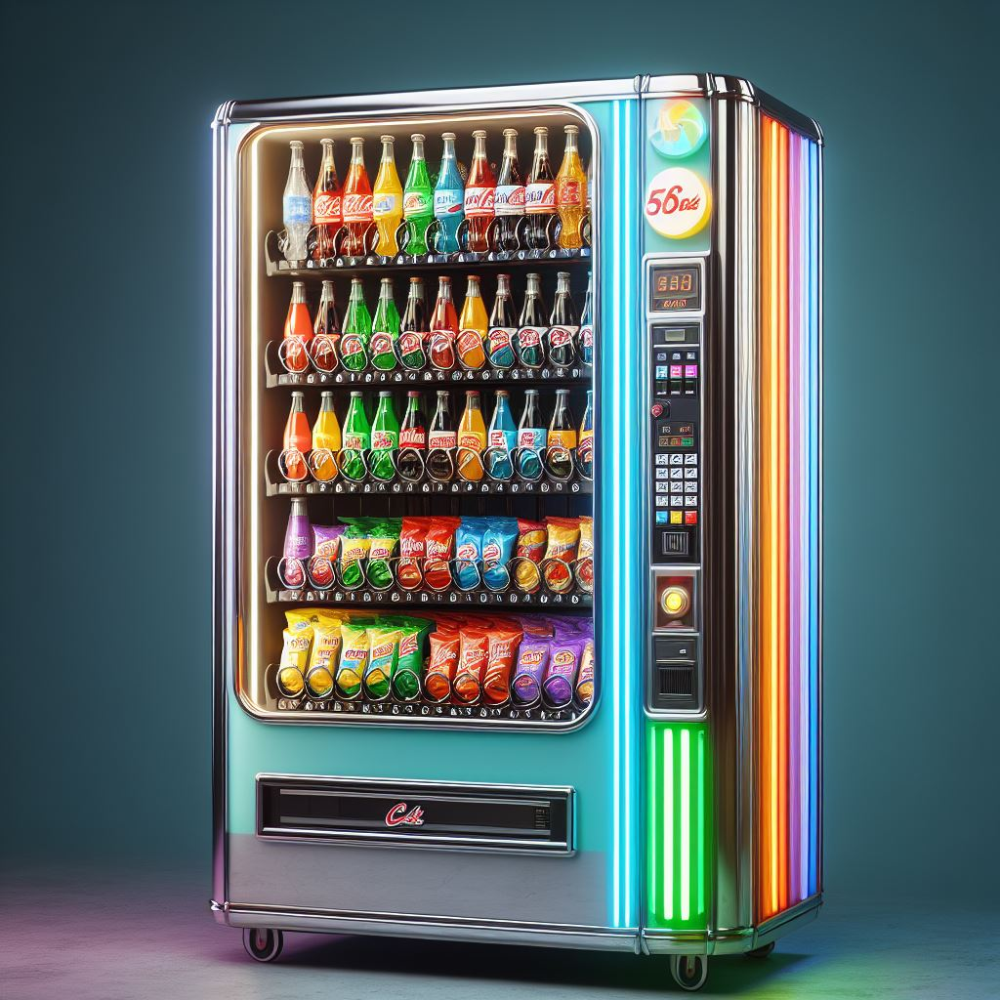

  

# Vending Machine Simulator

Welcome to the Vending Machine Simulator repository! 🍬🍫🥤

This Python program simulates a vending machine, offering a hands-on experience of selecting and purchasing various snacks and beverages. Created as part of the Introduction to Computing course during my first semester at the School of Electrical Engineering and Informatics, ITB.

## Overview

Ever wanted to understand the inner workings of a vending machine? This simulator provides a glimpse into the logic behind snack and beverage dispensing. The program utilizes Python to create a user-friendly interface for selecting items, processing transactions, and delivering the chosen goodies.

## Features

- **User-Friendly Interface:** Navigate the vending machine effortlessly with a simple and intuitive interface.
  
- **Snack and Beverage Selection:** Choose from a variety of snacks and beverages available in the virtual vending machine.

- **Transaction Simulation:** Experience the transaction process, including payment and item dispensing, just like a real vending machine.

## How to Use
    git clone https://github.com/rizqikapratamaa/Vending-Machine-Simulator-using-Python
    cd Vending-Machine-Simulator-using-Python
    python machine.py

## Notes

- This project was developed as part of the Introduction to Computing course during the first semester at the School of Electrical Engineering and Informatics, ITB.

Explore the fascinating world of vending machines with this interactive simulator. Happy vending! 🎉🤖